# 🍳 Savor Studio — Tableside Branding & Multi-Channel Menu Engine

**A white-label, production-ready dining branding engine and workspace.**

Savor Studio is a premium, unified content workbench built for restaurant brands. It enables restaurateurs to describe their branding details, colors, fonts, menus, and promotions **once** in a single structured JSON object, and instantly generates beautifully branded, channel-specific assets for **Email Newsletters**, **Mobile Digital QR Menus**, and **Print-ready Dining Layouts**.

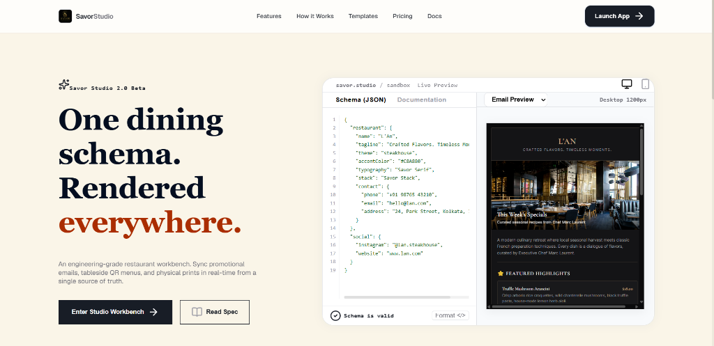

---

## 📌 Problem Statement

Restaurant owners face significant friction keeping their menus, branding, and promotions updated across multiple communication channels:
1. **Double Data Entry & Fragmentation:** Updating a price, adding a new signature dish, or announcing a promotion requires manual copy-pasting across promotional email campaigns (Mailchimp/Klaviyo), tableside mobile web pages (accessed via QR codes), and printed dining menus or back-of-house kitchen prep cards.
2. **Pricing & Brand Mismatches:** Discrepancies between printed menus and online mobile menus lead to customer confusion and operational errors.
3. **Design Overhead:** Designing separately for Email (which requires table-based responsive HTML), Web (which requires interactive, responsive CSS), and Print (which requires clean layouts and specific aspect ratios) typically demands different design tools or expensive developer resources.

---

## 💡 The Solution: Savor Studio

Savor Studio addresses these challenges using the philosophy of **"One source of truth → Multiple beautifully rendered outputs."** Powered by `@unlayer/react-elements` compatible blocks, the studio reads a single data schema and renders branded outputs across three media viewports:

1. 📧 **Promotional Email Newsletter:** A responsive, single-column table layout optimized for email clients, containing weekly specials, upcoming experiences, and contact details.
2. 📱 **Tableside Mobile Web Menu:** A mobile-first, interactive digital page featuring course filter categories, dietary badge indicators, and a live-generated, scannable tableside QR code.
3. 📄 **Print Dining Menu & Kitchen Prep Cards:** A dual-mode print engine that outputs either a high-end, print-ready layout for physical dining tables or structured recipe cards for kitchen staff.

### 🎨 Visual Theme Presets Catalog
Restaurateurs can instantly swap their restaurant's aesthetic with 6 curated designer presets. The studio dynamically translates font pairings, palettes, border structures, and shadow profiles across all renderers.

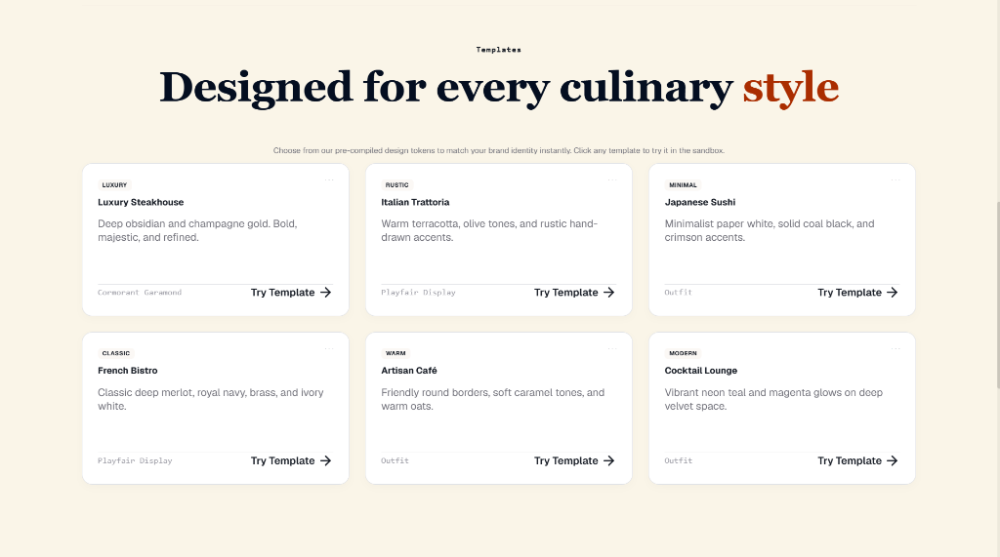

### 📣 Dining Brand Promo & Footer
Visual marketing block detailing tableside digital menus and lifestyle-focused dining branding.

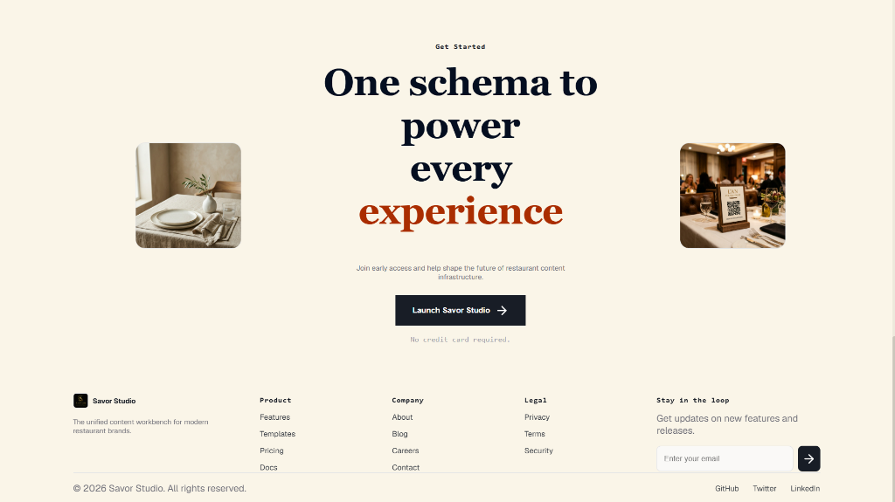

---

## 🛠️ Multi-Channel Output Workspace

Every restaurant template compiles to multiple outputs. The rendering logic preserves design tokens across all views:

### 💻 Split View Workspace Layout
A split-screen workspace featuring the real-time **Studio Editor** panel on the left and a live-updating **Split Preview Viewport** showing all output channels simultaneously.

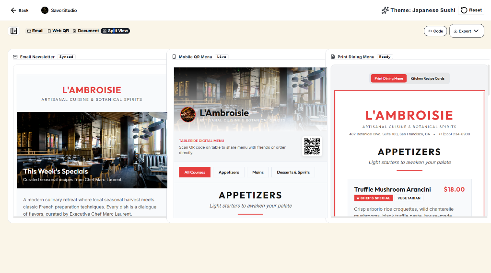

---

## 🎨 Visual Presets & Theme Previews

Below are previews of the interactive studio workspace running across different designer theme presets:

#### Luxury Steakhouse Theme
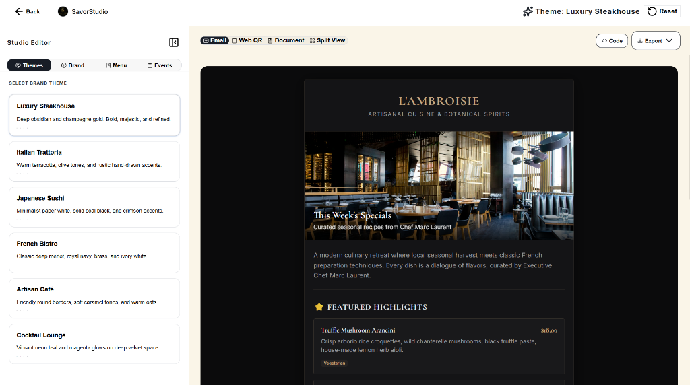

#### Artisan Café Theme
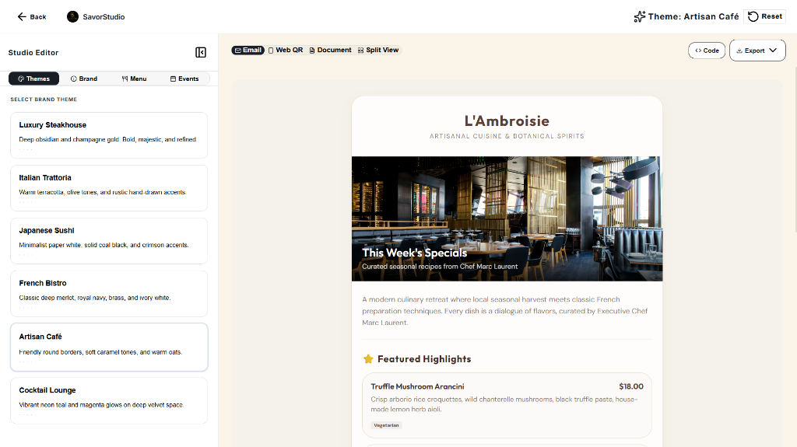

#### Italian Trattoria Theme
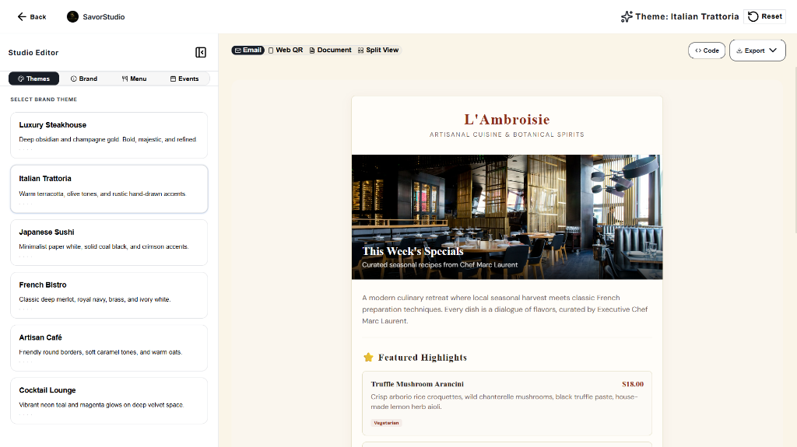

#### Japanese Sushi Theme
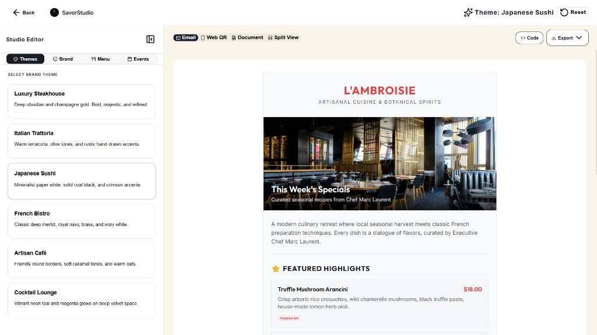

#### French Bistro Theme
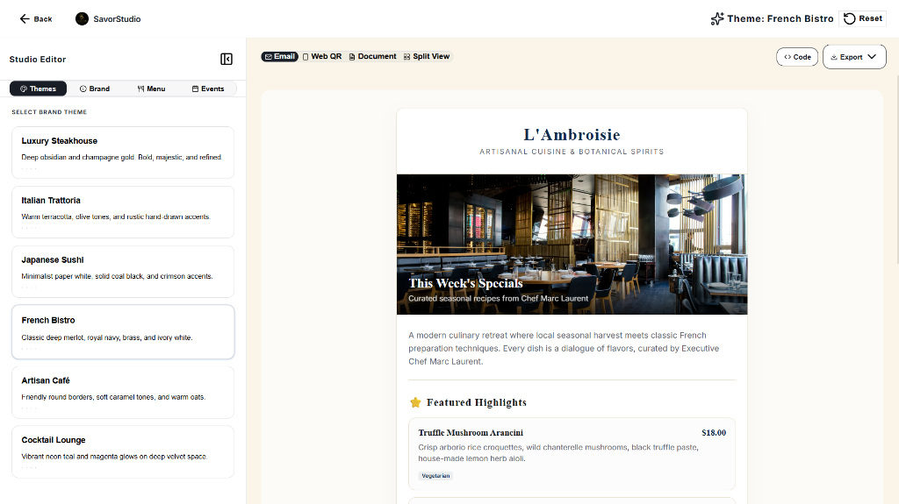

---

## 🖥️ Format Renderers & Views

* **[SavorEmail.tsx](src/elements/SavorEmail.tsx):** Built using inline-styled HTML blocks optimized for email deliverability.
* **[SavorWeb.tsx](src/elements/SavorWeb.tsx):** High-fidelity mobile & desktop view featuring category selectors, dietary badges, and a live QR code using `qrcode.react`. Supports an `isWebpageMode` desktop browser frame mockup.
* **[SavorDocument.tsx](src/elements/SavorDocument.tsx):** Reconfigurable page that structures print layouts using CSS page-break constraints, supporting dual-layout outputs (Dining Menu vs Kitchen Prep Cards).
* **[blocks.tsx](src/elements/blocks.tsx):** Shared layout blocks built around the grid structures of `@unlayer/react-elements`.

### Output Viewports

#### Interactive Web QR Page
A full-width, responsive digital tableside menu mockup.
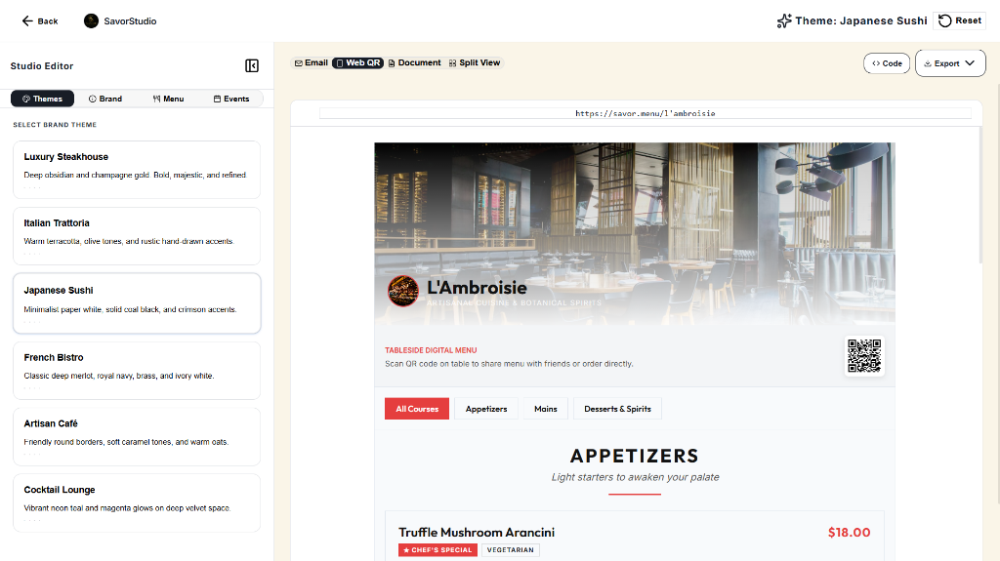

#### High-End Printed Dining Menu
Layout with print-tuned styling, pagination, and signature headers.
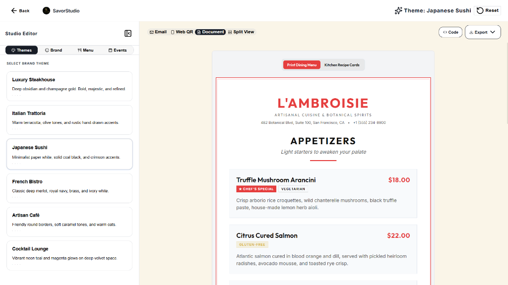

#### Back-of-House Kitchen Recipe Cards
A reconfigurable page layout outputting structured plating specs and recipe cards.
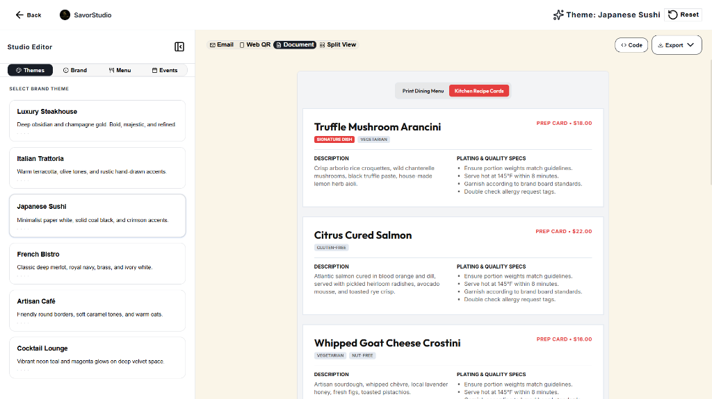

---

## ⚙️ Core Technical Architecture

### 1. Data Schema & Engine ([types.ts](src/types.ts))
Driven by the strictly typed `RestaurantData` model containing:
* **Branding:** Name, tagline, description, logo, and cover images.
* **Menu Structure:** Grouped sections (Appetizers, Mains, Desserts, etc.) and individual items with pricing, dietary tags (Vegan, Gluten-free, etc.), and chef recommendations.
* **Events & Promos:** Promotional cards containing descriptions, dates, pricing, and visual covers.
* **Contact & Operations:** Telephone number, address, email, operating hours, and social media handles.
* **Quality & Plating Specs:** Live-editable recipe check-lists (`recipeSpecs`) that render line-by-line inside prep sheets.

### 2. Exporter Engine & Capture Utils
Compiles active React preview layouts into raw HTML strings using `react-dom/server`'s `renderToStaticMarkup`. Contains utilities for:
* **JSON Download:** Exports the modified `restaurant.json` configuration file.
* **HTML Copying:** Instantly copies compiled Email HTML or Document Print HTML to clipboard.
* **High-Res PDF Export:** Launches the template in a clean window and triggers native browser print dialogs.
* **Offscreen Image Capture:** Dynamically imports `html2canvas`, clones the target offscreen, overrides scroll restrictions, and exports high-res `scale: 2` PNG files.

---

## 🛠️ Workspace & Configuration Panels

* **SaaS Landing Experience ([LandingPage.tsx](src/components/LandingPage.tsx)):** Features dark-mode aesthetics, glowing radial grids, and animated interactive mockups of the outputs using `framer-motion`.
* **Studio Workbench ([StudioDashboard.tsx](src/components/StudioDashboard.tsx)):** A split-screen layout containing the real-time configuration tabs for adjusting brand details, menu listings, and event cards.
* **CSS Layout System ([index.css](src/index.css)):** Implements design tokens, keyframe animations, scroll customizers, and an escaped utility system mapping Tailwind utility classes back to pure Vanilla CSS.

### Brand Editor Tabs

#### Brand Information Configuration Panel
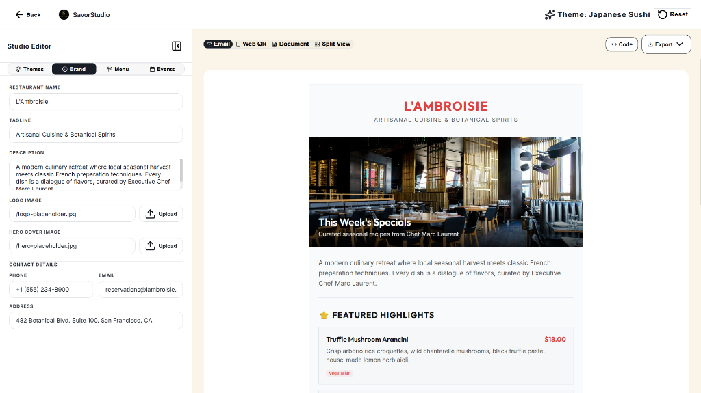

#### Menu Sections & Items Configuration Panel
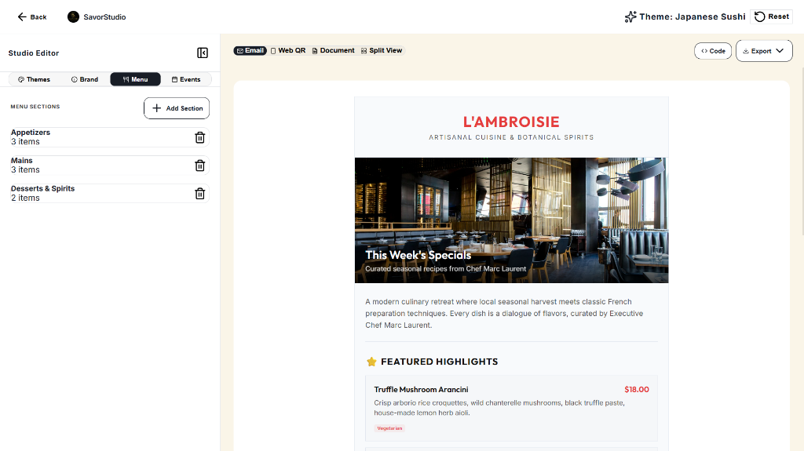

#### Restaurant Highlights & Events Configuration Panel
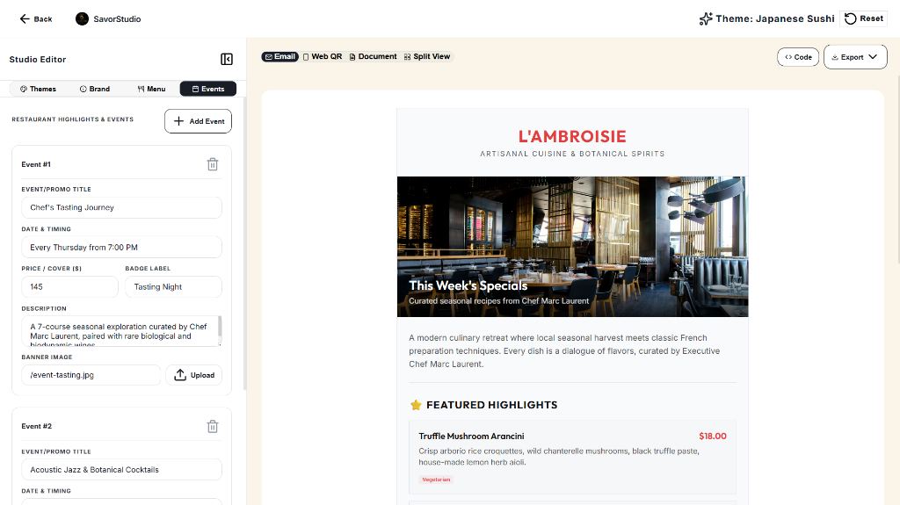

---

## 🚀 Setup & Local Run Instructions

To install and run Savor Studio on your local machine:

1. **Clone & Open Project:**
   Ensure you are in the project root directory.

2. **Install Dependencies:**
   Install required packages (includes `@unlayer/react-elements`, `framer-motion`, `lucide-react`, `sonner`, `canvas-confetti`, and `qrcode.react`):
   ```bash
   npm install
   ```

3. **Launch Development Server:**
   ```bash
   npm run dev
   ```

4. **Access Savor Studio:**
   Open your browser and navigate to the address outputted by Vite (typically `http://localhost:5173/` or `http://localhost:5174/`).

5. **Build for Production:**
   Verify code compilation and bundling:
   ```bash
   npm run build
   ```
